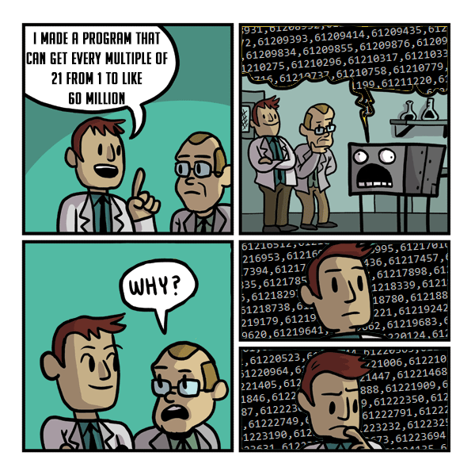

# Repaso foldl, recursividad, eager y lazy evaluation

**Fecha**: viernes 22/05/2026
## Visto en la clase
* video [Resuelto tp2](https://youtu.be/a6Bp_F1Rzo8?si=UhnGdj5SguAGzEPD)
* Apunte: [Recursividad. Evaluación diferida.](https://youtu.be/a6Bp_F1Rzo8?si=UhnGdj5SguAGzEPD)
## Para el parcial
* [Resolución del simulacro propuesta por la catedra](https://docs.google.com/document/d/1QP5lby65OFP7BZc8oC5_PTQqHMCN8OsZgl5dhf3lQz8/edit?usp=sharing)
# Recordatorio
El 5 de junio es el parcial de haskell, deberán llegar puntuales y pueden usar la guia de lenguajes en el examen, recomendamos llevarla. No estará permitido el uso de dispotivos electronicos.

