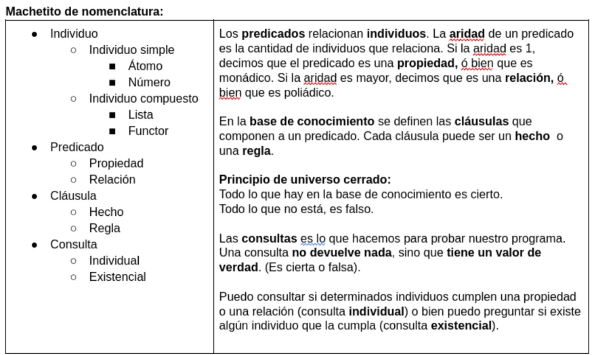

# Functores 

**Fecha**: viernes 26/06/2026
## Visto en la clase
* enunciado: [mundialito](https://docs.google.com/document/d/1WrRk-IbnsvmYurA24bgiYDIjmuxlnckQBI5gRDzf-u0/edit?usp=sharing)
* codigo: [hecho en clases](https://github.com/pdepviernestm/2026-functores)
* video [Functores y Polimorfismo](https://www.youtube.com/watch?v=svcXUVYcwLA)
* Apunte: [Lógico - Módulo 4.4 y 4.5](https://docs.google.com/document/d/1I8Xvss7LBuUjV-GGiag7C8d9wa3vUB6B37Qi4LG-ts0/edit?tab)
