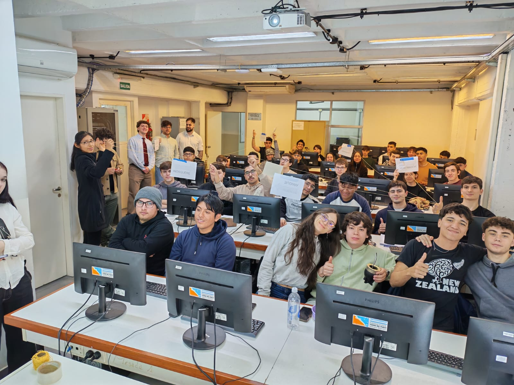

# Introducción al paradigma orientado a objetos


**Fecha**: viernes 04/9/2026

## Examen lógico
[enunciado](https://docs.google.com/document/d/1kxCFfjS-zi1juGBdMK9Xqpb6hIt7UQIHxHOhw2aBTB8/edit?usp=sharing)

[posible solución](https://docs.google.com/document/d/1X-qDJI7WA9fbJkh0AXmssV6ciaA2O4B8iXATtUeOIm0/edit?usp=sharing)
## Sobre lo visto en clase
| | Procedural | Funcional | Lógico | Objetos |
| :---- | :---- | :---- | :---- | :---- |
| Programa | Conjunto de Instrucciones | Funciones | Predicados | objetos |
| Efecto | Si | No | No | Si |
| Ejecuto | llamo procedimientos | llamo funciones | hago consultas | envio mensajes |
| variable | lugar en memoria | definición (son inmutables) | incognita | referencias |
| ¿=? | Asignación | equivalencia | igualdad | asignar  |
Durante clases hicimos este cuadro para ir viendo las diferencias entre cada paradigma y objetos. 


La dinámica de los caramelos nos permitó hacer varias observaciones:
* Los objetos interactúan entre ellos a traves de **mensajes** y para que estos se comuniquen es necesario que uno tenga la **referencia** de otro. Tio rico y kiosquere no se conocen, entonces no se pueden enviar mensajes 
* Cuando la bolsita respondía el mensaje de dar caramelo esta perdía caramelos, por lo tanto sabemos que hay efecto.
* Dos objetos pueden tener una referencia con un nombre distinto hacia un mismo objeto, la referencia no hace a la identidad del objeto.
* Si un objeto no conoce el mensaje va a devolver una excepción.

En resumen un objeto es un tipo de dato que es responsable de sus propias conductas, podemos pensarlo como un registro que contiene sus propias conductas. Hay tres características de un objeto que nos va a interesar:
1) Exponen una interfaz
    * Es un conjunto de operaciones que puedo hacer con un objeto, a eso le puede llamar mensajes. El mensaje es la única forma de interactuar un objeto. Esta va a ser la operación principal que vamos a estar utilizando. Definir una interfaz de un objeto es decidir qué puede hacer y que no.
2) Pueden tener un estado interno
    * Pueden tener atributos, que son básicamente referencias a otros objetos. Los atributos pueden ser mutables.
    Hablar de atributos mutables (listas, no lo nombramos ahora) vs atributos inmutables (todos los demás)
3) Tienen una identidad

## Ejercicio resuelto entre todos 
Realizamos una solución para el ejecicio 1 de la [primera guía de objetos](https://docs.google.com/document/d/1DQNuJwO3m6o_0-31tld94eJKJSQQ2TsjqBBY_rOVho4/edit?usp=sharing).

> 1. Codificar a pepita en Wollok, con estos patrones de modificación de la energía:  
>   * cuando vuela, consume un joule por cada kilómetro que vuela, más 10 joules de "costo fijo" en cada vuelo.  
>   * cuando come, adquiere 4 joules por cada gramo que come.  
>     No olvidar la inicialización. 
``` js
object pepita {
    const costoFijo = 10
    var energia = 200
    method volar(kilometroQueVuela){
    energia = energia - kilometroQueVuela - costoFijo
  }
    method comer(peso){
    energia = energia + peso * 4
  }
}
```
Puede que no parezca pero a esta altura tomamos un par de decisiones:
1. Se nos dice que el comportamiento se basa en formas de modificar la energía, por lo tanto los mensajes que entenderá pepita implicaran un cambio en sus atributos internos, energía podría dejar de referenciar al número con el que se inicializa, por lo tanto utilizamos la palabra reservada "var" que indica que la referencia puede cambiar. Por todo esto decimos que ambos métodos son de **efecto**. 
2. Costo fijo es un atributo que no necesita cambiar, por lo tanto va a referenciar siempre al objeto que representa el número 10.

>2. Pepita ahora es mensajera, le enseñamos a volar sobre la ruta 9\.  
> Agregar los siguientes lugares sobre la ruta 9, con el kilómetro en el que está cada  una, y agregar lo que haga falta para que:  
> * pepita sepa dónde está (vale indicarle un lugar inicial al inicializarla).  
> * le pueda decir a pepita que vaya a un lugar, eso cambia el lugar y la hace volar   la distancia.  
> * pueda preguntar si pepita puede o no ir a un lugar, puede ir si le da la energía para hacer la distancia entre donde está y donde le piden ir.

```js
object pepita {
    const costoFijo = 10
    var energia = 200
    var lugar = catamarca
``` 
El lugar va a cambiar, así que tiene sentido que sea variable
``` js
  method volar(kilometroQueVuela){
    energia = energia - kilometroQueVuela - costoFijo
  }

  method irA(nuevoLugar){
    self.volar(nuevoLugar.posKm() - lugar.posKm())
    lugar = nuevoLugar
  }
  method puedeIr(lugarAViajar) = 0 <= energia + (nuevoLugar.posKm() - lugar.posKm()) - costoFijo
```
Inicialmente tenía sentido pensar la lógica aritmetica dentro de volar, hasta que apareció otra parte del código que suscribe a esa misma lógica. Al ser una lógica común notamos que es conveniente delegarla en otro método del mismo objeto. 
``` js
  method volar(kilometroQueVuela){
    energia = resultadoViajar(energia - kilometroQueVuela - costoFijo)
  }

  method irA(nuevoLugar){
    self.volar((nuevoLugar.posKm() - lugar.posKm()).abs())
    lugar = nuevoLugar
  }
  method puedeIr(lugarAViajar) = 0 <= resultadoDeViajar((nuevoLugar.posKm() - lugar.posKm()).abs())

  method resultadoViajar(kilometroQueVuela) 
  { return energia - kilometroQueVuela - costoFijo}
  method energia() = energia
  
  method comer(peso){
    energia = energia + peso * 4
  }
}
```
Tal vez se pueda hacer lo mismo con distancia. Hay que entender de todas formas que no es lo mismo la necesidad de ordenar la lógica del negocio vs una operación matemática como el calculo de una distancia.  
``` js
object catamarca {
    const posKm = 20
    method posKm() = posKm
}
object salta {
    const posKm = 200
    method posKm() = posKm

}
```
## Para estudiar
[un video super recomendable](https://www.youtube.com/watch?v=eSYDeF-TcsE)
Hay nueva versión me miyuki!!!! en esta funciona el paradigma de objetos!!! Actualiceeeenn!!!!
https://github.com/miyukiproject/miyuki/releases/tag/pdep%2Fv1.0.8 

## Para resolver en casa
[Peligro por distacción](https://docs.google.com/document/d/1jc2JU2OcDf--hwlSViW7CrKnrvxYYhITR_DJrBT0zjM/edit?tab=t.0)
## Avisos parroquiales
La semana que viene hay un tp, vayan. Posiblemente sea de a dos  o más.
Porfa instalen wollok y si pueden lleven computadora si pueden, de toda formas vamos al labo.