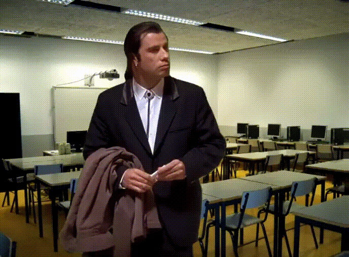

# Orden superior y lambdas

**Fecha**: viernes 8/05/2026
## Visto en la clase
* [Enunciado TP1](https://docs.google.com/document/d/1bapJQZ5l11Tc1wY4x8nElD9Tnx9aNek_5-traOuSxQE/edit?usp=sharing)
* [Tp1 resuelto](https://github.com/pdepviernestm/tp1_resuelto)
* [Diapos](https://docs.google.com/presentation/d/1BFGdNmtt-SR8WI97NIJrI0r9h4y6f5vz/edit?usp=sharing&ouid=113463891752122875534&rtpof=true&sd=true)
* [Codigo de orden superior](https://github.com/CamilaChoque/ejercicios-ejemplo-clases-pdp.git/)
* Apunte: [Funcional \- Módulo 5](hhttps://docs.google.com/document/d/1Rzsp5A46R_WdC-NJ6_SKrUrtZ6LmR5A52BazE9XPLIc/edit?tab=t.0) 
* Apunte: [Funcional \- Módulo 6](https://docs.google.com/document/d/1LKVaZHuJqxf2FcOK17vZjxq0CTT4sohqSsfhWmhQ6ks/edit?tab=t.0)

* Video: [Orden Superior](https://www.youtube.com/watch?v=3yi-vv0xC_g&feature=youtu.be) 
* Video: [Expresiones Lambdas](https://www.youtube.com/watch?v=pjnyD1omhj8&feature=youtu.be)  

## Ejercitación para la casa
* Miyuki:  Totalidad de los capitulos 5, 6, 9, 10 y 13 **(práctica)**

## Recordatorio 
* El viernes 15 de mayo tenemos tp individual, va a ser de a dos y en computadora, pueden traer sus propias computadoras.

