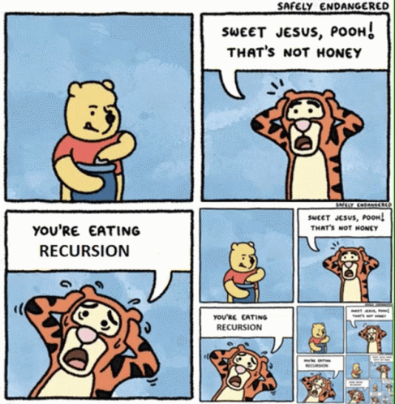

# Patrones de listas Recursividad Fold y test

**Fecha**: viernes 15/05/2026
## Visto en la clase
* [Enunciado tp2](https://docs.google.com/document/d/1YY_bfnJmL70uE-Q7G0HU02yTDprkoL2MrfXW1M1IlZo/edit?usp=sharing)
* Video: [Recursividad y Patrones de Listas](https://youtu.be/zR4XVIpKnZg) 
* Video: [Fold](https://www.youtube.com/watch?v=veiQkxz59NE)  
* Apunte: [Tests](https://docs.google.com/document/d/1GgfVtmyuAvDsRMnA--tP8wRYZnHf7PJDbHLEL7lo8Cw/edit?usp=sharing)
## Ejercitación para la casa
* Miyuki:Todo menos los de evalucación diferida y listas infinitas.

